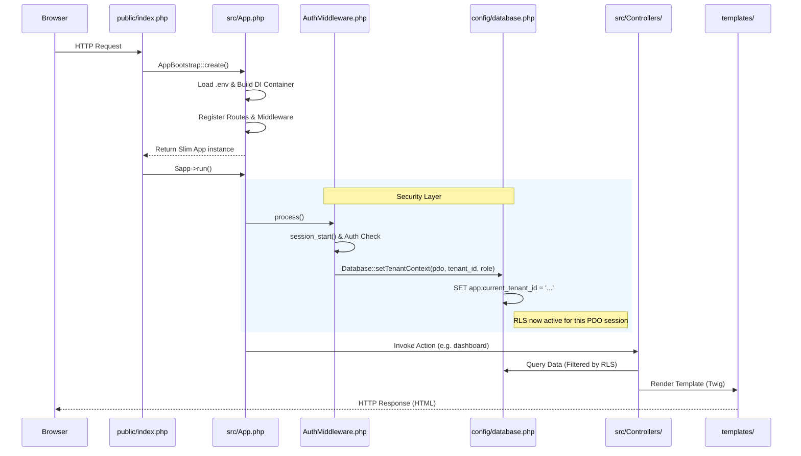
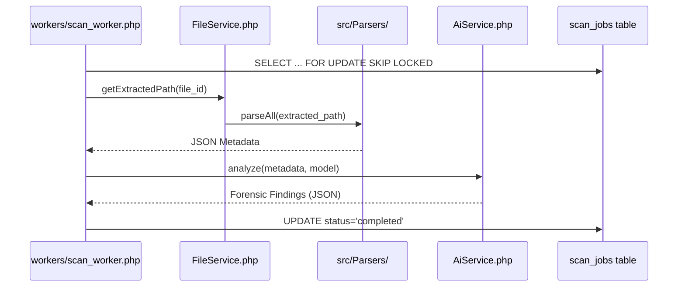

# AI DebugScan v3 - Key Project Data

This file maintains the essential state, architecture, and changelog of the AI DebugScan v3 implementation. It serves as a context bridge for continuous development.

## 1. Project Anatomy (Folder Structure)

| Layer | Directory / File | Purpose |
| :--- | :--- | :--- |
| **Strategy** | `public/index.php` | Main HTTP entry point. Bootstraps the application. |
| | `public/api/` | Specialized API endpoints (e.g., SSE for scan progress). |
| | `public/assets/` | CSS, Local SVGs/Icons, and client-side JS. |
| **Logic** | `src/App.php` | Application Bootstrap: DI Container, Routing, Middleware. |
| | `src/Services/` | Core business logic (AiService, ScanService, FileService). |
| | `src/Parsers/` | Diagnostic parsers for Hardware, RAID, Log, etc. |
| | `src/Controllers/` | Route handlers for Auth, Tenants, and Administrators. |
| **Security** | `src/Middleware/` | Global interceptors (AuthMiddleware for session & **RLS**). |
| | `src/Helpers/` | Utility classes (SessionHandler, ZipHelper). |
| **Data** | `migrations/` | SQL Schema and Row Level Security (RLS) policies. |
| | `config/database.php`| PDO connection factory with tenant context support. |
| **View** | `templates/` | Twig rendering engine templates (Layouts, Auth, UI). |
| **Infrastructure**| `workers/` | Background job consumers (AI process workers). |
| | `storage/` | Local storage for uploads and temporary extractions. |

---

## 2. File Loading Sequence (Execution Flow)

### Path A: Tenant / Admin Request Lifecycle
The following sequence describes how a request is handled from entry to rendering, including critical security context setting.

### Path B: Background Scan Job Lifecycle
The following sequence describes how diagnostic files are processed in the background.

---

## 3. Changelog & Versioning

| Version | Date | Author | Description |
| :--- | :--- | :--- | :--- |
| 1.0.0 | 2026-04-07 | Antigravity | Initial project structure and database foundation. |
| 1.1.0 | 2026-04-07 | Antigravity | Implementation of 7 Core Parsers and ParseService. |
| 1.2.0 | 2026-04-07 | Antigravity | AI Integration, Scan Queue, Worker, and SSE Progress. |
| 1.3.0 | 2026-04-07 | Antigravity | Full Tenant & Admin UI Modules (Dashboards, Reports, Settings). |
| 1.3.1 | 2026-04-08 | Antigravity | Creation of KeyData.md (Project Brain File). |
| 1.4.0 | 2026-04-08 | Antigravity | Added Folder Structure Map and Loading Diagrams (Markdown). |
| 1.5.0 | 2026-04-08 | Antigravity | Official Domain Configuration (dev.activelk.com) and VPS apply. |
